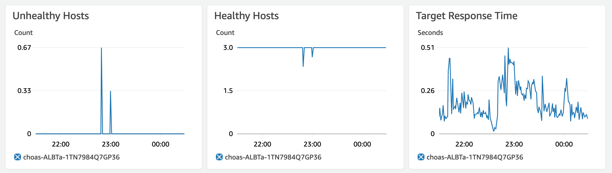

# Chaos Engineering for EC2-based Applications

## 5. Test EC2 Failure

This failure injection will simulate a critical problem with one of the three web servers used by your service.

Applications are at risk for a number of hazards at any given time.  Hazards such as an overloaded CPU, memory exhaustion, a filesystem with no remaining space, or too many open file descriptors - to name a few.  It is impossible to predict and simulate all possible permutations of environmental conditions in which your application operates. In the following lab you will:

* Create a Low Disk Space Error on one of the EC2 instances running your application

* Delete one of the instances hosting your application to observe the effect it has on the steady state

### 5.1 Application Steady State

Establish the steady state of the application.  Using the load generator set the load generator to 30 requests per second and observe the failure rate, average response time, and request rate.  Allow the system to settle into its steady state which should result in 0 failures, an average response time of 300 microseconds, and an RPS above 25.

### 5.1 Low Disk Space Experiment

In this experiment you will affect the storage of the instance hosting your application to observe its effect on the application.  There are different scenarios you can simulate but in this test you will presume that various logs and data files have been created on the system which have exhausted the available disk space.  You will then observe how a lack of disk space affects the application on the instance and the overall system as a whole.

To perform this experiment you will create a connection to a random instance which is hosting your application.  You will then run a PowerShell script to completely consume the available space on the C drive of the system.  You will then observe the effect this has on the steady state of the application.

1. To run this test you will first connect to one of the EC2 instances running your application through session manager

    ```bash
    ASG_NAME=$(aws cloudformation describe-stacks --stack-name ha-windows --query 'Stacks[].Outputs[?OutputKey==`AutoscalingGroupName`].OutputValue' --output text)
    EC2_INST=$(aws autoscaling describe-auto-scaling-groups --auto-scaling-group-names $ASG_NAME --query 'AutoScalingGroups[0].Instances[0].InstanceId'  --output text)
    aws ssm start-session --target $EC2_INST
    ```

1. Next, Execute the script below. The below PowerShell script will create a series of 1 Mb files in an effort to completely fill the available disk space on the C drive.

    ```PowerShell
    for ($i = 1; $i > 0; $i++) {
	    $file = [io.file]::Create(“disk.data.$i”)
	    $file.SetLength(1Mb)
	    $file.close()
    }
    ```

1. On another tab open Locust.io and keep on aye on the failures and RPS
1. Open another tab, on the sidebar, navigate to target groups under load balancing. Select the right target group and click on monitoring. Monitor how the graphs change as you run the script.

    


<b>Points to ponder:</b>
* What did you notice during the test?
* Why was the website not affected?
* Did you notice any changes when you increase the duration from 300 seconds to 600 seconds?
* If you ran the script for longer what do you think would happen to the instance?


### 5.2 EC2 Instance Termination

Whether its a full disk, overloaded CPU, or a crashed JVM - there are many things that could result in an application on an EC2 instance becoming unavailable.  It can be difficult to predict them all so its best to just assume that something can / will take down an application and simulate this by terminating an EC2 instance that is hosting the application.

In the previous lab you created a remoate, interactive session with one of the application instances.  While on that server you manually executed a command to disrupt the system.  In this next activity you will not only introduce a disruption but also script that disruption so that it can be executed with less manual intervention.

1. To begin create a simple shell script to terminate one of the EC2 instances.

    ```bash
    cat >fail_instance.sh <<'EOF'
    if [ $# -ne 1 ]; then
      echo "Usage: $0 <autoscalinggroup-name>"
      exit 1
    fi

    #Find the first running instance in the autoscaling group and return it's instance ID.
    EC2_INST=$(aws autoscaling describe-auto-scaling-groups --auto-scaling-group-names $1 --query 'AutoScalingGroups[0].Instances[0].InstanceId'  --output text)
    echo "Terminating $EC2_INST"

    # Terminate that instance
    aws ec2 terminate-instances --instance-ids $EC2_INST
    EOF
    chmod 0755 ./fail_instance.sh
    ```

1. Next execute the script, passing it the name of the autoscaling group holding the application.

    ```bash
    ASG_NAME=$(aws cloudformation describe-stacks --stack-name ha-windows --query 'Stacks[].Outputs[?OutputKey==`AutoscalingGroupName`].OutputValue' --output text)
    ./fail_instance.sh $ASG_NAME
    ```

    The script should output information similar to the following:
    ```bash
    Terminating i-0710123abc631eab3
    {
        "TerminatingInstances": [
            {
                "CurrentState": {
                    "Code": 32,
                    "Name": "shutting-down"
                },
                "InstanceId": "i-0710123abc631eab3",
                "PreviousState": {
                    "Code": 16,
                    "Name": "running"
                }
            }
        ]
    }
    ```

1. Go to the [EC2 Instances console](http://console.aws.amazon.com/ec2/v2/home?region=us-east-2#Instances:) and confirm that the specified instance is shutting down or terminating.  

1. If you click refresh on the EC2 console you should notice that the auto scaling group launches a new instance to replace the failed instance.

1. Observe the effect on the steady state of the application in the Locust.IO dashboard.  

During the course of the test the error rate for the application should not have exceeded normal levels (around 7%).  

**System Availability**

By monitoring the Locust.IO dashboard you should note that the availability for the application is maintained by the 2 remaining instances in the autoscaling group.  

**Load Balancing**
Load balancing ensures service requests are not routed to unhealthy resources, such as the failed EC2 instance.

1. Go to the [Target Groups console](http://console.aws.amazon.com/ec2/v2/home?region=us-east-2#TargetGroups:) and select the target group for your application.

1. Click on the Targets tab and note:

    - Status of the instances in the group. The load balancer will only send traffic to healthy instances.
    - When the auto scaling launches a new instance, it is automatically added to the load balancer target group.
    - In the screen cap below the unhealthy instance is the newly added one. The load balancer will not send traffic to it until it is completed initializing. It will ultimately transition to healthy and then start receiving traffic.
    - Note the new instance was started in the same Availability Zone as the failed one. Amazon EC2 Auto Scaling automatically maintains balance across all of the Availability Zones that you specify.

    

1. From the same console, now click on the **Monitoring** tab and view metrics such as **Unhealthy** hosts and **Healthy** hosts


**Auto Scaling**

Auto scaling ensures we have the capacity necessary to meet customer demand. The auto scaling for this service is a simple configuration that ensures at least three EC2 instances are running. More complex configurations in response to CPU or network load are also possible using AWS.

1. Go to the [Auto Scaling Groups console](http://console.aws.amazon.com/ec2/autoscaling/home?region=us-east-2#AutoScalingGroups:)

1. Click on the **Activity History** tab and observe:

    - The screen cap below shows that all three instances were successfully started at the same time.

    - At 19:29 the instance targeted by the script was put in draining state and a new instance ending in …62640 was started, but was still initializing. The new instance will ultimately transition to Successful status

    

Draining allows existing, in-flight requests made to an instance to complete, but it will not send any new requests to the instance. To learn more after the lab see [this blog post](https://aws.amazon.com/blogs/aws/elb-connection-draining-remove-instances-from-service-with-care/) for more information on draining.

To find out more about auto scaling groups see [EC2 Auto Scaling Groups documentation](https://docs.aws.amazon.com/autoscaling/ec2/userguide/AutoScalingGroup.html).  The documentation covers how auto scaling groups are setup and how they distribute instances.  Also see [Dynamic Scaling for Amazon EC2 Auto Scaling](https://docs.aws.amazon.com/autoscaling/ec2/userguide/as-scale-based-on-demand.html) for more details on setting up auto scaling that responds to demand

### 5.3 Conclusion

Deploying multiple servers and Elastic Load Balancing enables a service suffer the loss of a server with no availability disruptions as user traffic is automatically routed to the healthy servers. Amazon Auto Scaling ensures unhealthy hosts are removed and replaced with healthy ones to maintain high availability.

---

Now continue to the next lab to see how to test how the system responds to a [database failover...](06_rds_failure.md)